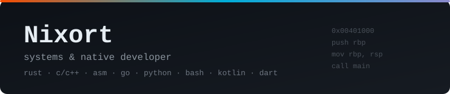

<div align="center">



---

### About

I build native software: system utilities, network services, parsers and
command-line tooling. I prefer explicit resource ownership, predictable
behavior, and code that outlives its author.

- **Core stack:** Rust, C/C++, Go, x86-64 / ARM64 Assembly
- **Automation &amp; scripting:** Python, Bash
- **Applied / mobile:** Kotlin, Dart (Flutter)
- **Reverse engineering:** IDA Pro, Ghidra, GDB, Radare2, objdump
- **Interests:** low-level optimization, concurrency, memory safety, binary
  analysis, protocols and serialization, developer tooling

---

### Tech

**Languages**


**Reverse engineering &amp; debugging**


**Toolchain**


---

### Engineering principles

```text
1. Correctness outranks development speed.
2. Errors are explicit. Silent degradation is unacceptable.
3. Minimal diffs. No drive-by refactors.
4. Abstraction appears on the third repetition, not earlier.
5. Resource ownership is obvious from the signature.
6. Optimize only after measuring.
```

---

### Focus areas

| Area | What it means in practice |
| --- | --- |
| Systems programming | Allocators, syscalls, IPC, file formats, daemons |
| Binary analysis | Static analysis in IDA Pro, patch diffing, format reversing |
| Performance | Profiling, cache behavior, hand-written SIMD/assembly hot paths |
| Reliability | Sanitizers, fuzzing, static analysis, deterministic tests |

---

### Activity

<div align="center">


</div>

---

### Contact

[](mailto:nixort@proton.me)

<sub>MIT © Nixort (Itan Winter)</sub>
